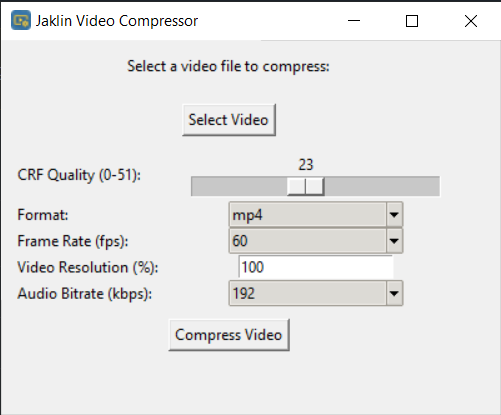

  

<h3 align="center">JaklinSimpleVideoCompressor</h3>

  
  
  

A practical GUI for <a href="https://www.ffmpeg.org/">FFMPEG</a> on Windows.

  

## 🧐 About 
⚠ _**NOTE: FFMPEG needs to be installed for Jaklin to work!**_ ⚠

JaklinSimpleVideoCompressor is a simple tool for compressing videos using [FFMPEG](https://www.ffmpeg.org/) on Windows. Jaklin is written in Python and uses [TKinter](https://docs.python.org/3/library/tkinter.html) for the GUI.

### Why?! 😱
I made a typo once in the terminal. This frustrated me enough to create a GUI to prevent me from ever making a typo again! 😶

### Features 🌟
- Change video quality with a simple slider. ⭐
- Change video format to the most popular formats! 📲
- Configure the FPS! 🎥
- Easily scale down resolution. 📉
- Change audio bitrate! 🎧🔊

## 🎈 Usage 
1. Download the application from the latest [release](https://github.com/pkg-dot-zip/JaklinSimpleVideoCompressor/releases).
1. Run it on your machine.
1. Select the video you want to compress.
1. Configure the settings to your liking. ⚙
1. Compress! 😋

## ⛏️ Built Using 
- [PyCharm](https://www.jetbrains.com/pycharm/) - IDE used
- [Python](https://www.python.org/) - Programming language used 
- [TKinter](https://docs.python.org/3/library/tkinter.html) - Framework used for the GUI
- [FFMPEG](https://www.ffmpeg.org/) - Used for compressing videos
- [PyInstaller](https://pyinstaller.org/en/stable/) - Used to bundle the application into a single _.exe_ file
- [IconKitchen](https://icon.kitchen/) - Used to create the icon